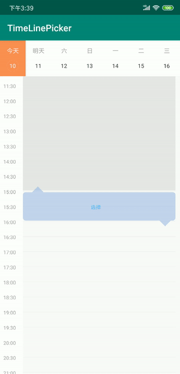
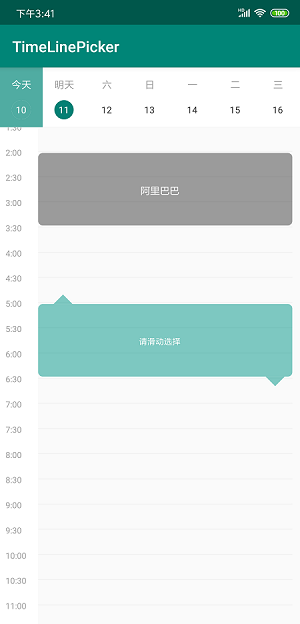

# TimeLinePicker

English

[Chinese](README.CN.md)

This is a library for people who want to show or pick up timelines on a table of 24 hours of a week, you could easily use it by default styles or you could diy your own colors and limitations. Thanks for using.

## Examples
### Default styles


### Diy styles


## Include

```
allprojects {
    repositories {
        ...
        maven { url 'https://jitpack.io' }
    }
}

dependencies {
    implementation 'com.github.nigalinson:TimeLinePicker:release-1.0'
}

```


## Using

### Easily using

```java

//xml
<cn.sloth.com.timepool.view.ChooserView
    android:id="@+id/chooser"
    android:layout_width="match_parent"
    android:layout_height="match_parent" />

//java
//listener
chooserView.setChooseDateListener(new ChooserView.ChooseDateListener() {
    @Override
    public void chooseDate(int inMess, Date date, int start, int end, int weekIndex) {
        //inMess: 0-normal / 1-mess with others / 2-out of time
        //start: picker start time. For example, 16 means 8 am, 17 means 8.30 am
    }
});

//destroy
chooserView.destroy();

```


### Further using

```java

//xml
 <cn.sloth.com.timepool.view.ChooserView
      android:id="@+id/chooser"
      android:layout_width="match_parent"
      android:layout_height="match_parent"
      app:weekPrimaryColor="#048074"
      app:weekSecondaryColor="#50ACA2"
      app:timelineChoosenColor="#79333333"
      app:timelineOutDateColor="#8B7E7E7E"
      app:pickerColor="#80009688"
      app:pickerMsgColor="#FFFFFE"
      app:pickerMessColor="#80C42828"
      app:pickerMessMsgColor="#FFFFFE"
      app:defaultCubeSize="2"
      app:minCubeSize="1"
      app:maxCubeSize="8"
      app:pickerString="Picking"
      app:pickerMessString="Has been used"
      app:pickerOutDateString="Out of date" />

//java
//listener
chooserView.setChooseDateListener(new ChooserView.ChooseDateListener() {
    @Override
    public void chooseDate(int inMess, Date date, int start, int end, int weekIndex) {
        //inMess: 0-normal / 1-mess with others / 2-out of time
        //start: picker start time. For example, 16 means 8 am, 17 means 8.30 am
    }
});

//set in showing dataset
 for(int i = 0; i < 7; i++){// must set 7 days
    //item of a day
    DayLine weekDataSet = new DayLine();
    //arrangements in a day
    SparseArray<TimeLineItem> arrangements = new SparseArray<>();
    TimeLineItem a1 = new TimeLineItem();
    a1.setId(1);
    a1.setName("阿里巴巴");
    a1.setStart(new Random().nextInt(24));
    a1.setEnd(a1.getStart() + new Random().nextInt(4) + 1);
    arrangements.append(arrangements.size(), a1);
    weekDataSet.setItems(arrangements);
    //set into picker
    chooserView.setTime(i, weekDataSet);
}

//destroy
chooserView.destroy();

```
